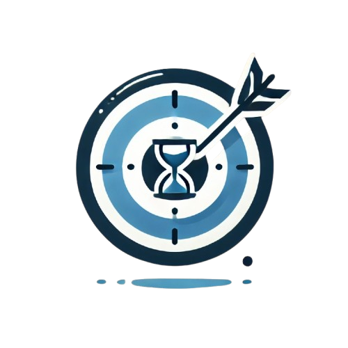

# FocusMorph - Transform Your Focus, Track Your Success (SVAP)

<p align="center">
  
  
</p>

This is a **responsive web** application designed to help you stay focused and productive. It features a Pomodoro timer, a task list, and a goals tracker.

**Features**
---


## Table of Contents

- [Features](#features)
- [Technologies Used](#technologies-used)
- [Installation](#installation)
- [Usage](#usage)
- [Screenshots](#screenshots)
- [Contributors](#contributors)

---

## Features

* **Task List** 
  - Lets you track your tasks and the due date
  - Tracks the progress of your task.

* **Pomodoro Timer:**
  - Set custom work and break intervals.

* **Goals Tracker:**
  - Set long-term and short-term goals.
  - Track progress towards goals.


## Technologies Used

- **Frontend**: HTML, CSS, JavaScript, React
- **Backend**: Node.js
- **Styling**: Tailwind CSS, Material UI
- **Hosting**: Vercel


## Installation

### Prerequisites

  - [NodeJS](https://nodejs.org/en)

### Steps to run the project

**Install the node modules and run the following command :**

``` bash
  npm i && npm run dev
```

## Usage

1. Access the Homepage: Open your web browser and navigate to the homepage URL.

2. Familiarize Yourself with the Interface: Explore each section of the homepage to understand where everything is located.


## Screenshots


**Homepage**

---

## Contributors

We thank the following people for their contributions to this project:

- **[Srikakulapu Pavan Aditya]** - [GitHub Profile](https://github.com/Pavan-Aditya123)
- **[Srivishnu T]** - [GitHub Profile](https://github.com/srivishnu2805)
- **[Vasist Kandagatla]** - [GitHub Profile](https://github.com/Vasist10)


## Contact

For any inquiries or feedback, reach out to:

- **Aryan Madhusudhanan**
- **Email**: [dotdev262@gmail.com](mailto:dotdev262@gmail.com)
- **GitHub**: [github.com/DotDev262](https://github.com/DotDev262)
